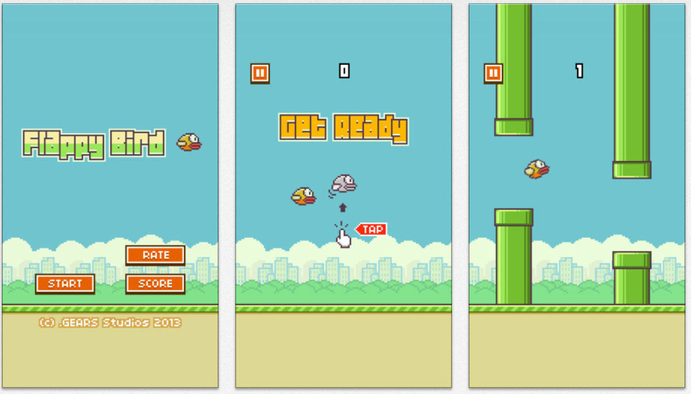
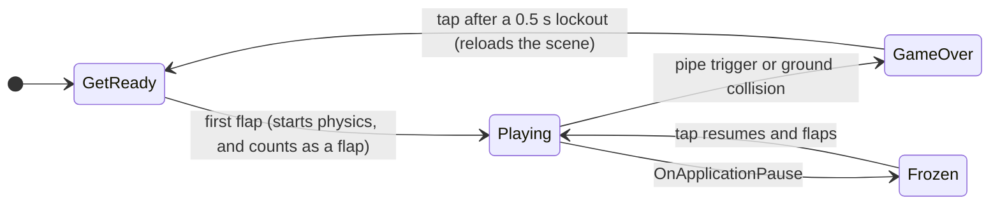
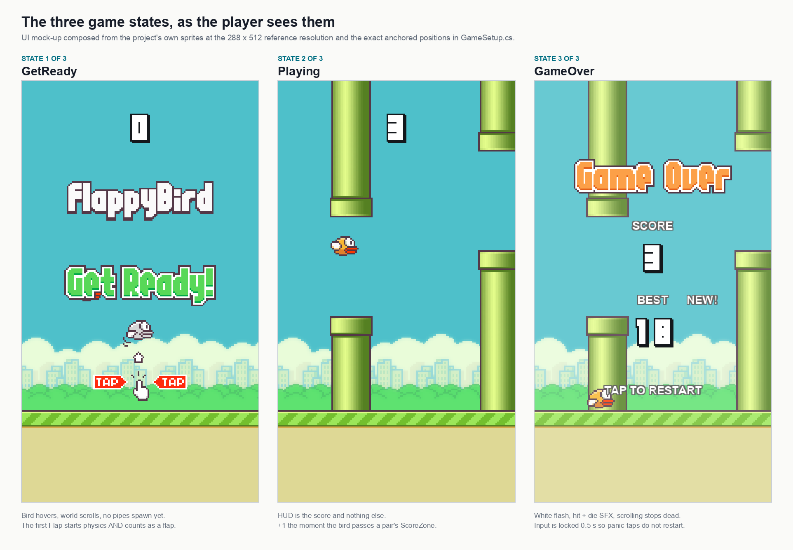
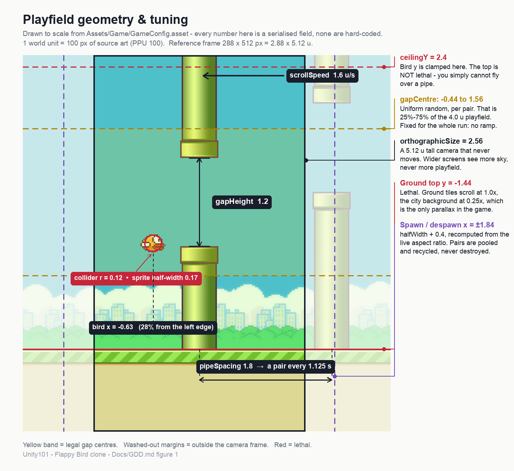
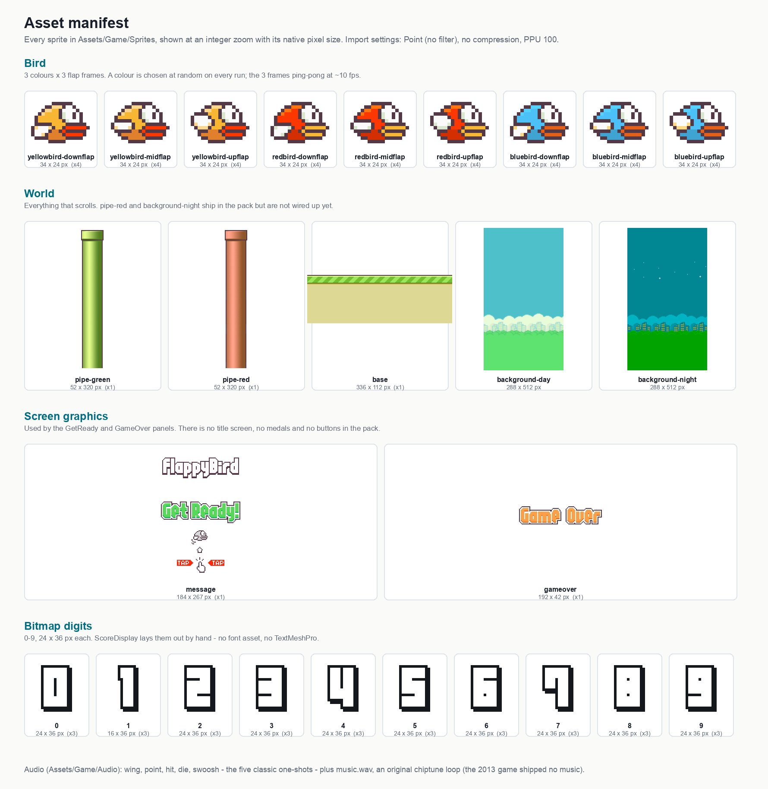
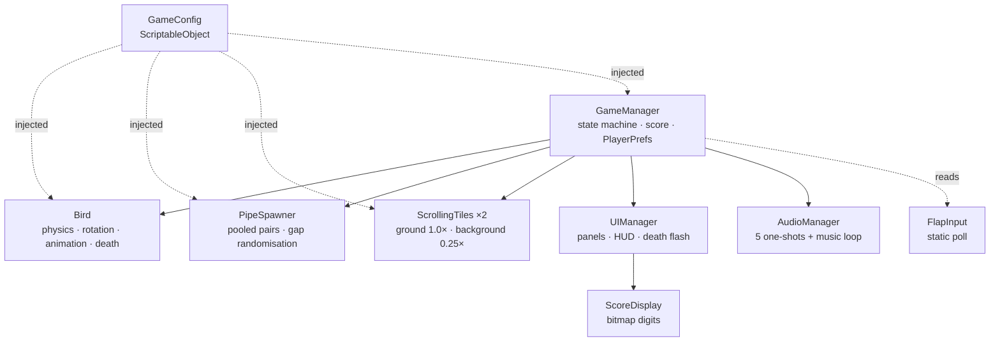

# Game Design Document — *Flappy Bird Clone*

| | |
|---|---|
| **Working title** | Flappy Bird Clone (`Unity101-FlappyBirb`) |
| **Team** | Doctor Unity (123456789) & Mr Unreal (987654321) |
| **Genre** | Arcade / endless obstacle-dodger / one-button score-chaser |
| **Target platform** | PC (Windows) + macOS, standalone. iOS/Android buildable but untested on device |
| **Engine** | Unity 6 (`6000.3.20f1`), URP 17.3, 2D, Input System 1.19 |
| **Orientation** | Portrait-first, 288 × 512 reference. Landscape runs, and simply shows more sky |
| **Session length** | 10 seconds – 5 minutes |
| **Document version** | v2.0 — 2026-08-30 |

> **Status legend used throughout:** ✅ built and playtested · 🔨 planned · ✂️ deliberately cut.
> This document describes the game as it actually is. Where it describes something that does not exist
> yet, it says so.

---

## 1. High Concept

A bird falls constantly under gravity. One input — tap, click, or space — **replaces** its vertical
velocity with a fixed upward impulse. The world scrolls left at a constant speed past an endless run of
pipe pairs with a fixed gap at a random height. Clear a gap, +1. Touch a pipe or the ground, die. Restart
takes under two seconds.

### Design pillars

1. **One input, total depth** — the entire skill ceiling lives in the timing of a single button. *Rejects:* a dash, a shield, a second button, anything with a cooldown.
2. **Instant restart** — failure costs pride and nothing else; death to next run is under two seconds. *Rejects:* results animations that cannot be skipped, an unlockable meta-layer, a loading screen.
3. **Absolute fairness** — fixed gap size, no difficulty ramp, deterministic physics at a fixed 50 Hz. Every death is the player's fault and must feel like it. *Rejects:* power-ups, random wind, adaptive difficulty, and — importantly — any frame hitch during play, which is why §8 has a zero-allocation rule.

---

## 2. Reference & Inspiration

- **Primary reference:** *Flappy Bird*, Dong Nguyen / .GEARS, 2013. [Gameplay video](https://www.youtube.com/shorts/oMMGCsbHoN8).
- **Taking:** the exact feel — velocity-replacing flap, constant scroll, fixed gap, no ramp. The classic sprite and audio set. The sub-two-second death-to-retry loop.
- **Not taking:** the medal/results panel and the title screen (see §9.3), and the original's total absence of music — this build adds an original chiptune loop, because a silent 30-second retry loop is a worse teaching demo than a scored one.

---

## 3. Core Game Loop

**Moment-to-moment rules** — true on every frame of `Playing`:

- The bird has **no horizontal movement**. Its `x` is fixed; the pipes, ground and background move left past it. The camera never moves either. This is the single most load-bearing simplification in the game.
- A flap **replaces** vertical velocity with `+5.0 u/s`. It never adds to it. Adding lets rapid tapping accumulate into an escape to the top of the screen, and the game stops being Flappy Bird. This is one line of code (`Bird.cs:FixedUpdate`) and it is the whole feel.
- Input is polled on **press** in `Update`, queued as a bool, and applied in `FixedUpdate`. No flap is ever dropped between physics steps, and no flap is ever double-applied.
- Bird pitch is **purely cosmetic**: snaps to +25° on flap, then lerps toward −90° as the dive builds past −4 u/s. It never affects the collider.
- **Scoring:** +1 on entering the `ScoreZone` trigger — a collider filling the gap between each pipe pair. One trigger per pair, so a score can never be double-counted.
- **Death:** overlap with a pipe trigger, or collision with the ground. The **ceiling is not lethal** — the bird is clamped at `y = 2.4` — so the player cannot fly over a pipe, but is never killed by the sky.
- **On death:** white full-screen flash, `hit` immediately and `die` 0.3 s later, all scrolling stops dead in the same frame, and the bird keeps its gravity and tumbles to the ground while the results panel is already up. Input is ignored for 0.5 s so a panic-tap cannot skip the score.

---

## 4. Tuning Values

Every value below is a serialised field of `Assets/Game/GameConfig.asset`, a ScriptableObject. Nothing
here is hard-coded, so the whole game can be re-tuned in the Inspector without a recompile — which is
the only reason the values in the *Notes* column below ever got found.

**1 world unit = 100 px of source art (PPU 100).** The camera is orthographic, `size = 2.56`, so it
shows a fixed 5.12 u of height at any aspect ratio.

| Parameter | Field | Value | Notes |
|---|---|---|---|
| Gravity scale | `gravityScale` | 1.8 | Softened from 2.5 after the first playtest — the fall was unrecoverable |
| Flap velocity (**set**, not added) | `flapVelocity` | +5.0 u/s | Softened from 6.5 for the same reason |
| Terminal fall velocity | `terminalVelocity` | −10 u/s | Clamped, so a long dive stays survivable |
| Ceiling clamp | `ceilingY` | 2.4 | Not lethal — see §3 |
| Scroll speed | `scrollSpeed` | 1.6 u/s | Constant for the whole run. Never ramps — pillar 3 |
| Gap height | `gapHeight` | 1.2 u | Fixed for the whole run |
| Pipe spacing | `pipeSpacing` | 1.8 u | ⇒ one pair every **1.125 s** at the scroll speed above |
| Gap centre range | `gapCenterMin/Max` | −0.44 … 1.56 | Uniform random per pair = 25 %–75 % of the 4.0 u playfield |
| Flap / dive pitch | `flapPitch`, `divePitch` | +25° / −90° | Cosmetic only |
| Dive threshold, lerp | `diveVelocityThreshold`, `rotationLerpSpeed` | −4 u/s, 8 | |
| Restart lockout | `restartLockout` | 0.5 s | |
| Bird collider | *(prefab)* | Circle, r = 0.12 u | 0.24 u across, against a 0.34 u wide sprite. Deliberately generous — deaths must never feel cheap |
| Bird x | *(runtime)* | −0.44 × halfWidth | 28 % in from the left edge, recomputed from the live aspect ratio |

**Feel target:** a first-time player scores ≥ 1 within five attempts; a practised player reaches 10+.
The in-repo `AutoPilot` bot currently peaks at 18, which is the regression test for "did I break the feel".

---

## 5. Controls & Input

One logical action: **Flap**. `FlapInput.Pressed()` is a static poll over every device the Input System exposes.

| Action | Keyboard | Mouse / Touch | Gamepad |
|---|---|---|---|
| Flap / start / restart | `Space`, `Enter`, `W`, `↑` | Left click, any touch | South button (A) |

- Read on **press** in `Update`, applied in `FixedUpdate` — no dropped or doubled inputs.
- On `GetReady`, the first flap both starts physics **and** counts as the first flap. The bird must never appear to swallow the player's first input.
- On `GameOver`, input is ignored for `restartLockout` = 0.5 s.
- On focus loss mid-run (`OnApplicationPause`), `Time.timeScale` goes to 0 rather than the bird dying off-screen. The next tap resumes *and* flaps, so the player never loses a run to alt-tab.
- ✂️ There is no `EventSystem.IsPointerOverGameObject()` guard, because there are no buttons — every UI element in the game is non-interactive. Adding a button means adding that guard.

---

## 6. Screens & UI

There are no scenes but `Game.unity`, and no menus. The three states in §3 *are* the screen inventory.
See the [screens figure](images/screens.png) above.

1. **GetReady** ✅ — `message` sprite (logo + "Get Ready!" + tap hint) centred; score `0` in the HUD.
2. **Playing (HUD)** ✅ — the score, top-centre, 40 px down, in the classic bitmap digits. Nothing else. No timer, no lives, no pause button, no ads — the HUD is deliberately one number.
3. **GameOver** ✅ — `gameover` sprite at +140; `SCORE` / value; `BEST` / value; a `NEW!` tag when the best was beaten this run; `TAP TO RESTART`. Plus a one-frame white full-screen flash on death.

**Canvas setup:** Screen Space – Camera, `CanvasScaler` in *Scale With Screen Size*, reference 288 × 512,
`matchWidthOrHeight = 1` (height). The camera shows a fixed **world height**, so the UI must scale by
height too or the HUD drifts relative to the playfield on other aspect ratios.

**Known cosmetic issue:** `ScoreDisplay` lays every digit out on a fixed 24 px advance, but `1.png` is
only 16 px wide, so a `1` is stretched. Fix is per-digit widths, or padding the sprite. 🔨

---

## 7. Art & Audio

**Licence note — read this before building anything public.** The sprites and sound effects are the
original *Flappy Bird* assets, © Dong Nguyen / .GEARS, mirrored via
[samuelcust/flappy-bird-assets](https://github.com/samuelcust/flappy-bird-assets). They are used here for
**private educational purposes only**. Do not publish a build containing them — not to a store, not to
itch.io, not to a web host. For any public release, swap in CC0 replacements (Kenney.nl "Tappy Plane"
style kits work directly) and rename the game. Every art and audio reference in this project is loaded
by name through `GameSetup.cs`, so a reskin is a folder swap and one editor menu click, not a code change.
`music.wav` is the exception: it is an original, licence-free generated chiptune loop and may ship.

| Asset | Variants | Use |
|---|---|---|
| Bird | 3 colours × 3 flap frames | One colour chosen at random per run; frames ping-pong `0,1,2,1` at 10 fps |
| Pipe | `pipe-green` | One sprite, flipped vertically for the top pipe. `pipe-red` ships unused |
| Background | `background-day`, `background-night` | One chosen at random per run, applied to all 5 tiles |
| Ground | `base` | 336 × 112, tiled ×4 |
| Screen graphics | `message`, `gameover` | GetReady and GameOver panels |
| Digits | `0`–`9`, 24 × 36 | HUD and results, laid out by hand — no font asset |
| SFX | `wing`, `point`, `hit`, `die`, `swoosh` | The five classic one-shots |
| Music | `music.wav` | Original chiptune loop, `volume = 0.4`, looping |

**Technical art rules:** Point (no filter) import, no compression, PPU 100. The camera clears to
`#4EC0CA` so a letterboxed frame never shows black. Sorting order back → front: background `0` →
pipes `10` → ground `20` → bird `30` → UI canvas.

---

## 8. Technical Design

**Scenes:** one — `Assets/Scenes/Game.unity`, the only scene in Build Settings.

**Packages:** Input System 1.19, URP 17.3 (separate `PC_RPAsset` / `Mobile_RPAsset`), Physics2D. No 3D physics.

**Target device:** macOS/Windows desktop, portrait 9:16 Game View.

**Scene generation:** the entire scene is built by code — **Tools ▸ Flappy Bird ▸ Build Game Scene**
(`Assets/Game/Editor/GameSetup.cs`). The scene file is therefore reproducible and reviewable; a
hand-edited `.unity` file is neither.

| Script | Responsibility |
|---|---|
| `GameManager` | The state machine, scoring, best-score persistence, focus-loss freeze |
| `Bird` | Rigidbody2D physics, velocity-replacing flap, cosmetic pitch, flap animation, death |
| `PipeSpawner` | Distance-based spawning of pooled pipe pairs, aspect-aware spawn/despawn x |
| `ScrollingTiles` | One generic looping tile row; instanced twice, at 1.0× and 0.25× |
| `ScoreZone` | The trigger between a pair that fires `AddScore` |
| `ScoreDisplay` | Renders an int with the classic digit sprites |
| `UIManager` / `AudioManager` / `FlapInput` | Panels & flash / SFX & music / input poll |
| `AutoPilot` | Dev-only playtest bot. Never saved into the scene; attach to the Bird at runtime |

**Key decisions and their costs:**

- **Physics.** Dynamic `Rigidbody2D` with `gravityScale` from config, `Interpolate` on, continuous collision detection. All movement in `FixedUpdate` at 50 Hz, so the game plays identically at 60 and 120 Hz.
- **Pooling.** Pipe pairs are pooled and recycled, never destroyed. Ground and background tiles are recycled by repositioning. **Nothing is instantiated during `Playing`** — a GC spike is a dropped frame, and a dropped frame in a one-input timing game is an unfair death, which breaks pillar 3.
- **Restart reloads the scene** (`SceneManager.LoadScene`). This is a real trade-off, taken deliberately: reloading costs a few frames — measurably worse than resetting state in place — but it removes an entire class of "I forgot to reset that field" bugs, and at this scene size the reload is still comfortably inside the two-second budget of pillar 2. If it ever misses that budget, this is the first thing to change.
- **Config.** Every gameplay number in §4 lives in one ScriptableObject.
- **Persistence.** `PlayerPrefs["HighScore"]` only. No cloud, no accounts, no settings file.
- **Frame rate.** `Application.targetFrameRate = 60` on every platform.

### The two course features this project demonstrates

1. **Object pooling** — `PipeSpawner` keeps a `Queue<Transform>` of recycled pipe pairs and `ScrollingTiles` recycles ground/background tiles by repositioning them. Chosen here, rather than `Instantiate`/`Destroy`, because the spawn cadence is one pair every 1.125 s *forever*, and this is precisely the shape of workload where allocation churn turns into visible hitching.
2. **ScriptableObject-driven configuration** — `GameConfig` holds all thirteen tuning values. Chosen because the design work in §4 was almost entirely re-tuning: two of those numbers changed after the very first playtest, and each change had to cost seconds, not a recompile.

---

## 9. Scope

### 9.1 MVP ✅ — complete and playtested

- [x] Bird physics, velocity-replacing flap, cosmetic rotation, 3-frame animation
- [x] Pooled pipe pairs, random gap heights, aspect-aware spawn/despawn
- [x] Scrolling ground and parallax background, random day/night, random bird colour
- [x] Collision → GameOver → instant restart
- [x] Score, best score persisted, bitmap-digit HUD and results panel, `NEW!` tag
- [x] All five classic SFX plus a looping original music track
- [x] Death flash, focus-loss freeze
- [x] Desktop build (Windows / macOS)

### 9.2 Polish 🔨 — not built

- [ ] Per-digit widths in `ScoreDisplay` (see §6)
- [ ] Mute toggle, persisted in `PlayerPrefs`
- [ ] Mobile: safe-area handling, portrait lock, on-device testing
- [ ] Score count-up animation and `swoosh` on the results panel

### 9.3 Explicitly out of scope ✂️ — **not** being built

- **Title screen and menus.** The GetReady state already does the job in one tap fewer, and pillar 2 says every tap between death and the next run is a cost.
- **Medals (bronze/silver/gold/platinum).** The classic asset pack contains no medal sprites, so this is an art task, not a code task — and it adds a beat to the results panel that pillar 2 argues against.
- **A pause screen.** Focus loss freezes the game, which covers the only case that actually loses runs. A pause button would be the first interactive UI element in the game and would drag in the `EventSystem` guard from §5.
- **Ads, IAP, leaderboards, accounts, any online service.**
- **Difficulty ramping, power-ups, multiple game modes, level progression.** Pillar 3. The classic's purity is the product.
- **`Enemy.cs`** — a leftover empty stub from a lesson demo. It is not part of this design; delete it.

---

## 10. Plan, Risks & Open Questions

### Milestones

| Milestone | Contents | Status |
|---|---|---|
| M1 — Greybox | Bird physics, placeholder pipes, death & restart, feel tuned | ✅ |
| M2 — MVP | §9.1 with the classic assets | ✅ |
| M3 — Polish | §9.2, mobile tested on device | 🔨 |

### Risks

| Risk | Impact | Mitigation |
|---|---|---|
| Classic assets end up in a public build | Legal / takedown | §7 policy; all art loaded by name so a reskin is a folder swap |
| The feel drifts away from the reference | Pillar 1 fails | `GameConfig` for live tuning; `AutoPilot` best-score as a regression signal; side-by-side with the reference video |
| A frame hitch causes an unfair death | Pillar 3 fails | Zero allocations during `Playing`; pooling everywhere; profiler pass before any release |
| This document drifts from the build | The document becomes decoration | Status markers (✅/🔨/✂️) on every claim, and a changelog that says what changed and why |

### Open questions

1. Should the ceiling ever become lethal at high scores as a soft difficulty ramp? **Current lean: no** — it contradicts pillar 3 outright.
2. Is a WebGL build worth it for easy sharing? **Current lean: only after a CC0 reskin**, because a public web host is exactly what §7 forbids.
3. Should `restartLockout` scale with score, so a good run is harder to skip past? **Current lean: no** — inconsistent input timing is worse than a skipped score panel.

---

## Changelog

| Version | Date | Change |
|---|---|---|
| v2.0 | 2026-08-30 | Reconciled the document against the shipped build. Corrected four claims that had drifted: restart **does** reload the scene (and this is now documented as a deliberate trade-off rather than an accident); the background **does** parallax at 0.25×; there **is** a music loop; medals, the title screen and the pause screen are **not** built and have moved to §9.3 with reasons. Replaced the ASCII loop diagram with Mermaid, added the playfield-geometry, screens and asset-manifest figures, and added ✅/🔨/✂️ status markers throughout. |
| v1.0 | 2026-07-19 | Initial document, written before implementation |
